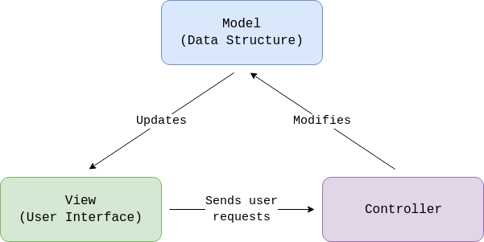

# Creating a Data Structure Structure

## Context
In many cases, your application will need to manage data about its users. Using data structures you can easily manage how this data will be serialized and de-serialized. If you are building an application using the [MVC](https://en.wikipedia.org/wiki/Model%E2%80%93view%E2%80%93controller) pattern, data structures correspond to the "Model" part of it.

## Prerequisites

* Eclipse Dirigible IDE

* Existing project

## Example

Let's say for the purposes of this tutorial you have a "Student" model in your app and your model contains "ID" and "Grade" fields (or columns in terms of databases).

## Procedure

1. Open Eclipse Dirigible IDE
2. Under the `Workspace Explorer` tab locate the root folder of your project.
3. Right-click on the root folder.
4. A drop-down will appear. Select `New > Data Structure`.
5. The window will now prompt you to select a template for your data structure. Select `Relational Database Table`  and click `Next`.
6. In order to add a column to your model click the `Add` button.
7. A new window will appear. Here you put the information about the column. In the form, type "*ID*" for `Name` and select *INTEGER* from the `Type` drop-down. Because we don't want any duplicating ID's, check the `Not Null?` and `Primary Key?` check boxes.
8. Click `OK` .
9. Click `Add` again. Type "*Grade*" for `Name` and select *DOUBLE* for `Type` . Finish the definition by clicking `OK` again.
10. Locate the `File Name` field at the bottom of the window and type "*student.table*". 
11. Click `Finish`.

## Result

You have now successfully added a data structure to your application.

## Navigation

- [Intro](README.md)

- [Creating a New Project](NewProject.md)
- [Creating a Data Structure ](DataStructure.md)
- [Creating a Scripting Service](ScriptingService.md)
- [Creating User Interfaces](UserInterfaces.md)
- [Creating Wiki Pages](WikiPages.md)