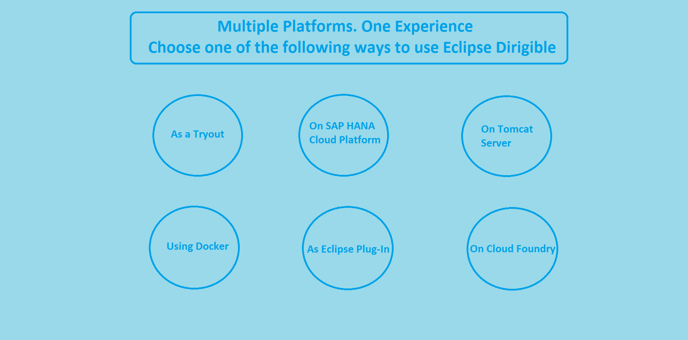

<h1>Welcome to Dirigible!</h1>
<h2>What is Dirigible?</h2>
Eclipse Dirigible™ is a Cloud Development Platform providing development tools and runtime environment. It supports full development life-cycle of on-demand applications by leveraging in-system programming models and rapid application development techniques. See: http://www.dirigible.io/project.html
<h2>What can you do with Dirigible?</h2>
Eclipse Dirigible provides capabilities for end-to-end development process from database modeling and management, through RESTful services authoring using various dynamic languages, to pattern-based user interface generation, role based security, external services integration, testing, debugging, operations, and monitoring. See: http://www.dirigible.io/features.html
<h2>Is it free?</h2>
Yes,all the Eclipse Dirigible project's source code and sample applications are licensed under Eclipse Public License - v 1.0 and maintained at GitHub.
<h2>For what can Dirigible be used and by whom?</h2>
<h4>For Education </h4>
  
You can develop student projects, test different technologies and scenarios, learn popular programming languages.

<h4>For Developers</h4>
 
&nbsp;&nbsp;&nbsp;&nbsp;-Eclipse Dirigible provides everything you need for your development project:</h5>
 
&nbsp;&nbsp;&nbsp;&nbsp;-Application server

 
&nbsp;&nbsp;&nbsp;&nbsp;-Content repository

 
&nbsp;&nbsp;&nbsp;&nbsp;-Web IDE

 
&nbsp;&nbsp;&nbsp;&nbsp;-Variety of features

 <h4>For Business</h4>
 
You can easily develop, document, and monitor your business applications, taking full advantage of the diverse selection of features and services offered by Eclipse Dirigible.

<h2>Platforms</h2>

<h3>As a Tryout</h3>
<h4>Pros:</h4>
 &nbsp;&nbsp;&nbsp;&nbsp;-No additional downloads and installations. 
 &nbsp;&nbsp;&nbsp;&nbsp;-No need to deploy anything. 
 &nbsp;&nbsp;&nbsp;&nbsp;-You get all the functionality. 
<h4>Cons: </h4>
 &nbsp;&nbsp;&nbsp;&nbsp;-One instance is shared between all the users. 
 &nbsp;&nbsp;&nbsp;&nbsp;-You cannot manage this instance. 

<h3>On SAP HANA Cloud Platform</h3>
<h4>Pros:</h4>
&nbsp;&nbsp;&nbsp;&nbsp;-Use the SAP HANA Cloud Platform services. 
&nbsp;&nbsp;&nbsp;&nbsp;-Work in your own instance. 
&nbsp;&nbsp;&nbsp;&nbsp;-Have full control over this instance. 
&nbsp;&nbsp;&nbsp;&nbsp;-You get all the functionality. 
<h4>Cons:</h4>
&nbsp;&nbsp;&nbsp;&nbsp;-You need an SAP HANA Cloud Platform account. 

 <h3>On Tomcat Server</h3>
<h4>Pros:</h4>
&nbsp;&nbsp;&nbsp;&nbsp;-Works offline.
&nbsp;&nbsp;&nbsp;&nbsp;-You get all the functionality.
<h4>Cons:</h4>
&nbsp;&nbsp;&nbsp;&nbsp;-You need to transfer your application to the cloud for the users to be able to find and use it.

 <h3>Using Docker</h3>
<h4>Pros:</h4>
&nbsp;&nbsp;&nbsp;&nbsp;-Uses less system resources.
&nbsp;&nbsp;&nbsp;&nbsp;-You can have many docker images in a single instance.
<h4>Cons:</h4>
&nbsp;&nbsp;&nbsp;&nbsp;-Docker environment has to be set up in advance.

 <h3>As Eclipse Plug-In</h3>
<h4>Pros:</h4>
&nbsp;&nbsp;&nbsp;&nbsp;-Works offline.
&nbsp;&nbsp;&nbsp;&nbsp;-You can use your favorite editors.
<h4>Cons:</h4>
&nbsp;&nbsp;&nbsp;&nbsp;-Lacks some capabilities, such as UI rendering.

 <h3>On Cloud Foundry</h3>
<h4>Pros:</h4>
&nbsp;&nbsp;&nbsp;&nbsp;-Easily manage your multiple Eclipse Dirigible instances.
&nbsp;&nbsp;&nbsp;&nbsp;-Use large scale landscapes.
<h4>Cons:</h4>
&nbsp;&nbsp;&nbsp;&nbsp;-You need to set up Cloud Foundry infrastructure or to have an account on a public PaaS.

<h2>Tutorials</h2>
<h3><a href="https://github.com/dirigiblelabs/curriculum/blob/master/BorislavTodorov/Documentation/Creating%20a%20project.md">Creating a project</a>
 

<a href="https://github.com/dirigiblelabs/curriculum/blob/master/BorislavTodorov/Documentation/Creating%20a%20data%20structure.md">Creating a data structure</a>

<a href="https://github.com/dirigiblelabs/curriculum/blob/master/BorislavTodorov/Documentation/Creating%20a%20scripting%20service.md">Creating a scripting service</a>

<a href="https://github.com/dirigiblelabs/curriculum/blob/master/BorislavTodorov/Documentation/Creating%20the%20documentation.md">Creating the documentation</a>

