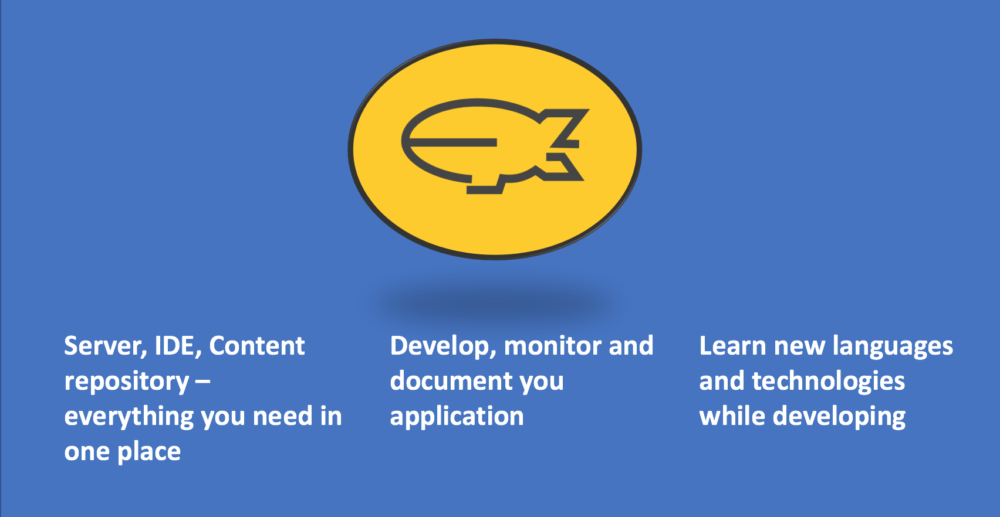

# Eclipse Dirigible Documentation

### What is Eclipse Dirigible
_Eclipse Dirigible™ is a Cloud Development Platform providing development tools and runtime environment. It supports full development life-cycle of on-demand applications by leveraging in-system programming models and rapid application development techniques._

### Dirigible - Basics: 

#### [1.Creating a project](Documentation/DirigibleBasics/1.CreatingProjects.md)

#### [2.Creating a data structure](Documentation/DirigibleBasics/2.DataStructures.md)

#### [3.Creating a scripting service](Documentation/DirigibleBasics/3.ScriptingServices.md)

#### [4.Creating a user interface for entity](Documentation/DirigibleBasics/4.UserInterfaces.md)

#### [5.Managing entity template](Documentation/DirigibleBasics/5.ManageEntityTemplate.md)
