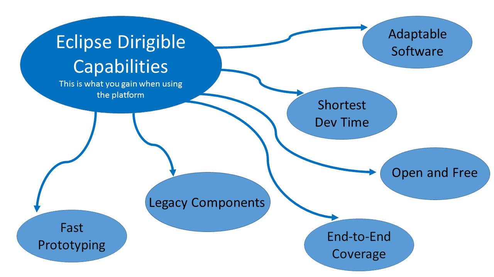

##Eclipse Dirigible™

ECLIPSE DIRIGIBLE™ IS A CLOUD DEVELOPMENT PLATFORM PROVIDING DEVELOPMENT TOOLS AND RUNTIME ENVIRONMENT. IT SUPPORTS FULL DEVELOPMENT LIFE-CYCLE OF ON-DEMAND APPLICATIONS BY LEVERAGING IN-SYSTEM PROGRAMMING MODELS AND RAPID APPLICATION DEVELOPMENT TECHNIQUES.

[Dirigible - Mobile Applications](https://github.com/dirigiblelabs/curriculum/blob/master/DanielaLozanova/Dirigible%20-%20Mobile%20Applications.md)

[Eclipse Dirigible - Launchpad Templates](https://github.com/dirigiblelabs/curriculum/blob/master/DanielaLozanova/Eclipse%20Dirigible%20-%20Launchpad%20Templates.md)

[Eclipse Dirigible - GitHub Interaction](https://github.com/dirigiblelabs/curriculum/blob/master/DanielaLozanova/Eclipse%20Dirigible%20-%20GitHub%20Interaction.md)
