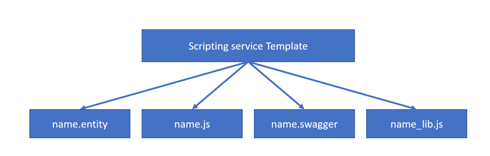

# Create a Scripting Service of Your Project in Eclipse Dirigible

## Explanation

If you develop an application at some point you will face Data Structures. You can create them in you Eclipse Dirigible project and they will help you to manage your data is a simple way.
Follow the steps to learn how to create a Scripting Service of your project in Eclipse Dirigible.

## Prerequisites

Have eclipse dirigible project.

## Steps
1. Open **Eclipse Dirigible Web IDE**.
2. Navigate to the **Workspace Explorer** view and find you project.
3. Right-click on your project folder.
4. Select **New** > **Scripting service**.
5. Dialog window appears.
6. Select **JavaScript Entity Service on Table** from available templates. 
7. Choose **Next**.
8. Find and select your table from **Available Tables and Views**. 
9. Then choose **Next**.
10. Add name to your service. 
11. Choose **Finish**.

## Results

In **Preview** tab there are two .js files generated by the template.
In your project folder you can find .entity file which holds the metadata for the Entity Service, .js for service endpoint implementation script, .swagger - swagger complaint service definition and another .js file for scripting service reusable modules.

  

 

#### Next:
### [5. Create Documentation](5.Documentation.md)

 

#### See also:
### [1. Data Structures](1.DataStructures.md)
