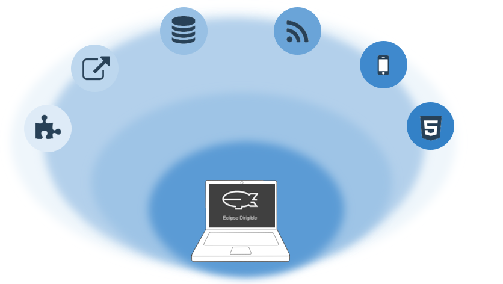

# Eclipse Dirigible

Wellcome to the Eclipse Dirigible Documentaion home page.

## Content: 

### [1. Data Structures](Basics - 1. Data Structures.md)

Learn ahow to create and use Data Structures.

### [2. Scripting Service](Basics - 2. ScriptingService.md)

Learn how to add Scripting Service to your project and execute it.

### [5. Create Documentation](Basics - 5. Documentation.md)

After developing your project you will need a proper documentation to be made.