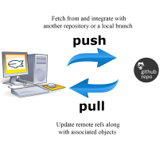

# Eclipse Dirigible - GitHub Interaction

In this tutorial, you will learn how to share your Eclipse Dirigible project 
with a GitHub repository, how to pull changes from and push changes to GitHub.
For more information, you can watch [**this video**](https://www.youtube.com/watch?v=rerOZSkfbWs&index=2&list=PLNKd01MEkVeJYLtQ2S4HZyDQ1turGCZwr&t=0s).

### Prerequisites
* *Log in* or *sign up* to [GitHub](www.github.com).
* *Log in* [Dirigible Web IDE](http://dirigible.eclipse.org/).

### Procedure
We will show you how to make a new project in the Dirigible Web IDE. If you want to do it for existing project, miss steps 2 and 3.

To create and upload new project, follow the steps:
1. Click *+* > *New repository*, enter **Repository name** and click *Create repository*. Copy the URL, showing in the *Quick setup box*.
2. Open the Dirigible Web IDE in the Workbench persepective. 
	1. Click *New* > *Project*, enter name of the project in the box **Enter project name**. 
	2. Click *Next* and choose *Blank Application* > *Finish*.
3. Right-click on the project name, *New* > *Scripting Service*. 
	1. Select *Hello world service (JavaScript)* > *Next*. 
	2. Enter **File Name** and click *Finish*.
4. Right-click on the project name, *Team* > *Share*. 
	1. Paste the URL, copied on step 1 in the field **Location**. 
	2. Enter **Commit message**, **Username**, **Password** and **Email**. 
	3. Click *Ok*. You can see your uploaded project in the GitHub repository.

##### Changes on your project in GitHub
When you make some changes on your project in GitHub:
* Right-click on the project name, *Team* > *Pull* > *Ok*.
Your changes are made in the project in Dirigible Web IDE.

##### Changes on your project in Dirigible Web IDE
When you make some changes on your project in Dirigible Web IDE:
* Right-click on the project name, *Team* > *Push*. 
* Enter **Commit message**, **Username**, **Password** and **Email**. 
* Click *Ok*. 
Your changes are made in the project in GitHub.

