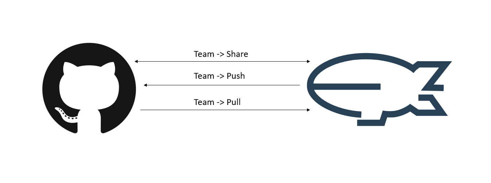

# How to Ineract with GitHub in Dirigible
## Prerequisites
* Have a project created in Dirigible. For reference you may read [How to Create a Project in Dirigible](https://github.com/dirigiblelabs/curriculum/blob/master/IvetaChampoeva/Documentation/Basic%20Steps/Dirigible%20Basics%20-%20Create%20Project.md)
## Basic Operations
* **Initial Commit**
  1. You must have and existing git repository, or create a new one.
  2. Copy the HTTPS or SSH URL for the git repository clone
  3. Right click on your project **Team > Share**
  4. Paste the above copied URL in **Location** and fill the other fields.
* **Pull from GitHub**
  1. Open a file from GitHub view and edit it.
  2. Commit your changes.
  3. Right click on your project **Team > Pull**
* **Push to GitHub**
  1. Edit a file in your project.
  2. Save the changes.
  3. Right click on your project **Team > Push**.
  4. Fill in the necessary fields.

  

