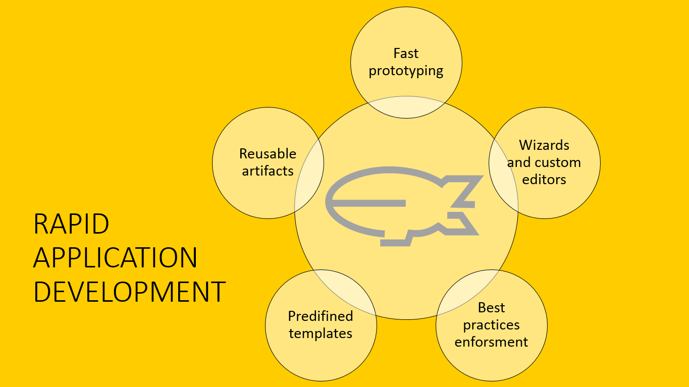

# Eclipse Dirigible™

Eclipse Dirigible™ is a Cloud Development Platform providing development tools and runtime environment. It supports full development life-cycle of on-demand applications by leveraging in-system programming models and rapid application development techniques.

  

Eclipse Dirigible provides capabilities for end-to-end development process from database modeling and management, through RESTful services authoring using various dynamic languages, to pattern-based user interface generation, role based security, external services integration, testing, debugging, operations, and monitoring.

You can develop student projects, test different technologies and scenarios, learn popular programming languages.

Eclipse Dirigible provides everything you need for your development project:
* Application server
* Content repository
* Web IDE
* Variety of features

You can easily develop, document, and monitor your business applications, taking full advantage of the diverse selection of features and services offered by Eclipse Dirigible.

**To learn how to work with Eclipse Dirigible™ folow the steps**
1. Create a project and a custom Data Structure for your application. See [Create a Data Structure](https://github.com/dirigiblelabs/curriculum/tree/master/KalinaGeorgieva/DataStructures.md).
2. Create a Scripting Service for your generated Data Structure. See [Create a Scripting Service](https://github.com/dirigiblelabs/curriculum/tree/master/KalinaGeorgieva/ScriptingServices.md).
3. Create a generic User Interface for your application entities. See [Create a User Interface](https://github.com/dirigiblelabs/curriculum/tree/master/KalinaGeorgieva/UserInterfaces.md)
