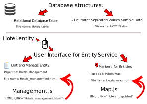

# Eclipse Dirigible - Markers for Entities

In this tutorial, you will learn how to create map markers for entity in Eclipse Dirigible.

### Common
We will show you how to create project with the **database structures**:
>	- Relational Database Table
>	- Delimiter Separated Values Sample Data

We will use the **scripting service**:
>- CRUD Service on Table (JavaScript)

We will create **user interface for entity service** from the template:
>- List and Manage Entity - to manage entities
>- Markers for Entities - to see a map with markers

We will create relations between entities.

### Prerequisites
Log in Dirigible Web IDE.

### Procedure
Follow the steps:
1. Open the Dirigible Web IDE in the Workbench persepective. 
	1. Click **New** > **Project**, *Enter project name*. 
	2. Click **Next** and choose **Blank Application** > **Finish**.
2. Right-click on the project name, **New** > **Data Structure**. 
	1. Select **Relational Database Table** and click **Next**. 
	2. Click **Add** at down left corner. 
	3. Enter *Name*, choose *Type*. You can enter *Length*, and other options. Fox example:
	```
    ID
    INTEGER
    [x] NOT NULL
    [x] PRIMARY KEY
    ```
  
	4. Click **Ok**.
3. To add more columns, repeat step 2. You should add colums, which will contain coordinates. For example:

| Name	        | Type          | Length  |NN?|PK?|Default|
| :------------:|:-------------:| :------:|:-:|:-:|:-----:|
| ID | INTEGER | 0 | true | true |
| NAME     | VARCHAR      |   250 | true | false |
| LAT | DOUBLE | 0 | true | false |
| LNG | DOUBLE | 0 | true | false |

When you're ready, click **Next**, enter *File Name* > **Finish**.
4. Right-click on the project name > **Publish**.
5. Right-click on the project name, **New** > **Data Structure**.
 	1. Select **Delimiter Separated Values Sample Data** and click **Next**. 
 	2. Select your project from **Available Tables**.
 	3.  Click **Next** > **Finish**.
6. Enter the information, according the columns, you created on step 2. You must use **|** separator between the columns, for example:
```
1|Sevilla Hotel|37.3891|-5.9844
2|King Louis Hotel|48.7980|2.3089
3|Pleasant Hill Hotel|40.4645|-73.7944
4|Bulgarian rose Hotel|42.6427|24.8063 
```

7. Right-click on the project name > **Publish**.
8. Right-click on the project name, **New** > **Scripting Service**. 
	1. Select **CRUD Service on Table (JavaScript)** > **Next**. 
	2. Select your project from **Available Tables**. 
	3. Click **Next** and enter *File Name*.
	4. Click **Finish**.
9. Unfold the project > **ScriptingServices** > project > **entity**.
	1. Right-click on the created entity > **Generate** > **User Interface for Entity Service**. 
	2. Select **List and Manage Entity**. 
	3. Click **Next** and **Select All**. 
	4. You can change fields' **Label**. 
	5. Click **Next** and enter *Page Title*.
	6. Click **Next** and enter *File Name*.
    7. Click **Finish**.
10. You can see your html by double click on the tab **Preview**.
11. Unfold the project > **ScriptingServices** > project > **entity**. 
	1. Right-click on the created entity > **Generate** > **User Interface for Entity Service**. 
	2. Select **Markers for Entities**. 
	3. Click **Next** and **Select All**.
	4. You can change fields' **Label**. 
	5. Click **Next** and enter *Page Title*.
	6. Click **Next** and Enter *File Name*.
	7. Click **Finish**.
	8. The map file opened. You should change `YOUR_APP_KEY` in the tag:
	
```
<script scr="https://www.maps.googleapis.com/maps/api/js?key=YOUR_APP_KEY&v=3.exp"></script>
```
12. Click :floppy_disk: to save the changes.  See again your changes by double click on the tab **Preview**. The map with markers will show.
13. If you want to connect the map to some item in **index.html**:
	1. Navigate to project > **ScriptingServices** > project > **extension** > **Management.js**.
	2. Change `CONST HTML_LINK = "` *the name of your manage entity file, created on step 9* `.html "`.
	3. Navigate to project > **ScriptingServices** > project > **extension** > **Map.js**
	4. Change `CONST HTML_LINK = "` *the name of your map file* `.html "`.
	5. Click :floppy_disk: to save the changes. 
14. To see your changes, open *index.html* again.

# Example for structure and names of files.



