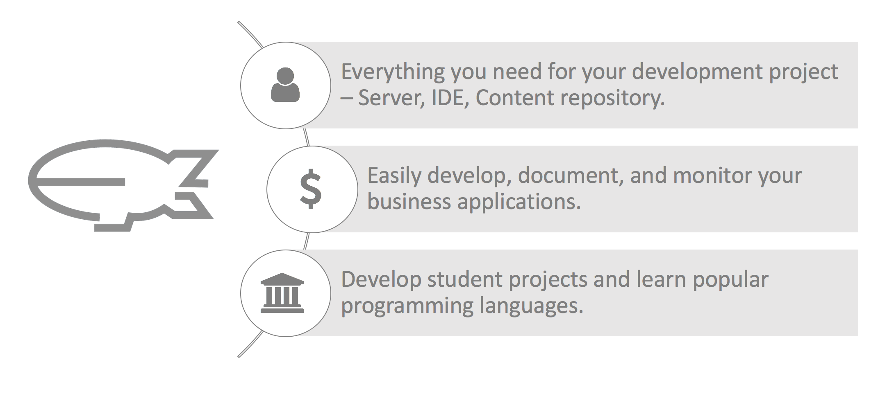

# What is Eclipse Dirigible
Eclipse Dirigible™ is a Cloud Development Platform providing development tools and runtime environment. It supports full development life-cycle of on-demand applications by leveraging in-system programming models and rapid application development techniques.

## Dirigible Web IDE Basics Guide

### Prerequisites
You need to have the Dirigible IDE loaded in your web browser in order to follow the steps in this guide.

### Guide Steps
1. [Create a Simple Dirigible Project](create_project.md)
2. [Create a Data Structure](data_structures.md)
3. [Create a Scripting Service](scripting_service.md)
4. [Create a User Interface](user_interfaces.md)